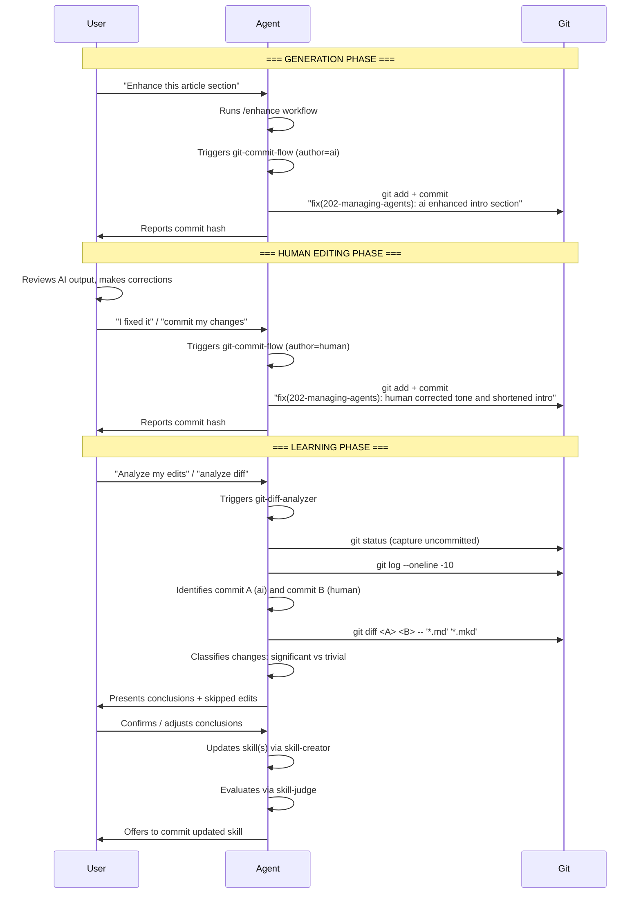

# Workflow Analysis: git-commit-flow + git-diff-analyzer

## The Imagined Full Workflow



## Concerns & Questions

### 1. Commit-Pair Identification: Resolved via Location Overlap

Both skills now use a consistent principle: commit descriptions name **where** changes happened (which files, or which sections of a single file), never summarize what changed in the content. This enables `git-diff-analyzer` to match commit pairs by **location overlap** — same folder scope AND overlapping files or sections in the description.

Example pair: `ai enhanced title and subtitle` ↔ `human corrected subtitle` — both reference the subtitle, so they match.

No SHA cross-referencing is needed: if `git-commit-flow` can infer the right files/sections for the description, `git-diff-analyzer` can match them back.

Remaining edge case: if a human commit says `human edited throughout the article` and multiple AI commits touched different parts, the match is ambiguous. The diff-analyzer handles this by asking the user to confirm.

---

### 2. Multi-Session Gap

The workflow assumes a tight generate→edit→commit→analyze loop, but in practice users frequently edit files between sessions—closing the IDE, re-opening the next day. This creates a gap that needs explicit handling.

#### What works without changes

- **Inferring WHAT changed**: The agent can always inspect the git working tree (`git status`, `git diff`) to see exactly which files and sections were touched. Commit messages describe the *what*, and the working tree provides that information even across sessions.
- **The missing WHY is acceptable**: Commit messages in this convention don't need to explain motivation—they need folder scope + file/section names touched. Both are available from the working tree regardless of session context.

#### Accepted restriction: user must signal their edits

If the user doesn't mention their edits at all, the workflow won't commit them separately. This is acceptable because:
- It's an opt-in workflow. No signal = the user doesn't want per-author tracking.
- The project-level instruction ("If the user signals that they edited a file(s)...") makes the contract clear.

However, missing human commits have **concrete negative consequences** for users who *do* care about the learning loop:

1. **Polluted AI commits**: The next `fix(...): ai` commit bundles the user's uncredited edits with AI changes. The diff-analyzer would later attribute human improvements to the AI—the learning loop extracts zero lessons from actual corrections.
2. **Silent overwrites**: If the user shortened a paragraph and the AI later re-expands it during enhancement, the human edit is lost with no git record it ever existed.
3. **Broken pair baselines**: When the user later says "analyze my edits," the AI baseline commit already contains human work. The diff shows only the delta from a mixed commit, yielding incomplete or misleading conclusions.
4. **Compounding drift**: After several cycles of untracked edits, `git blame` and `git log` no longer reliably reflect who authored what.

#### Mitigation: session-start uncommitted-changes check (implemented)

Three changes have been applied:

1. **Session-start check** — the project-level instruction in [README.md](../git-commit-flow/README.md#L29-L31) now includes a session-start `git status --short` that commits stale changes with author `human/ai` before the agent handles the first user message.
2. **Broadened trigger** — the instruction says "edited a file(s)" instead of "edited the AI-generated file(s)", so the user doesn’t need to know or remember whether a file was AI-generated.
3. **`git-commit-flow` handles all three triggers** via the [Step 2 decision logic](../git-commit-flow/SKILL.md#L66-L74): post-generation (ai), user-signaled edit (human), and session-start stale edits (human/ai).

---

### 3. The `human/ai` Combined Author: Valid Commit, Not a Diff Pair

`git-commit-flow` allows marking a commit as `human/ai` when both the user and the AI contributed to the changes. This happens in two scenarios:
- At session start, when uncommitted changes of mixed or unknown origin are found.
- When the agent detects that both it and the user modified files in the same pass (undesirable but possible).

These commits are **valid** — `git-commit-flow` exists not only for the learning loop but also to reduce the need for manual commits and ensure every eligible file change is tracked (see [README.md](../git-commit-flow/README.md#L8-L9)).

However, `git-diff-analyzer` **must skip** `human/ai` commits when searching for commit pairs. These commits are neutral checkpoints in the git history — they preserve the working tree state but don’t participate in the learning loop. 

---

### 4. Granularity Mismatch: Folder-Level Commits vs. File-Level Edits (minor)

Commit-flow creates **one commit per folder**, but the user might edit only some files or make different kinds of edits across files.

In practice, `git diff` only shows changed files — untouched files don’t appear in the diff at all. The diff-analyzer classifies each hunk independently (significant vs. trivial), so mixed edit types within a single diff are handled naturally.

**Remaining concern**: if the user makes completely unrelated edits in different files of the same folder, the analyzer might conflate independent one-off fixes into a false "pattern." The analyzer’s existing rule — “focus on patterns, not individual fixes” — mitigates this.

---

### 5. Mixed Intent in a Single Request (resolved)

Example: "Fix the typo on line 3 and also enhance the conclusion."

This is not a mixed-author scenario. The **agent** executes all the changes — both the typo fix and the enhancement. The `human` author is reserved for files the user edited **directly in their editor**, not for user instructions that the agent carries out. This commit is straightforwardly `ai`.

The only true mixed case is when the user edits files between sessions and the agent then makes further changes in the same uncommitted working tree — handled by the session-start `human/ai` check.

---

### 6. The `feat` + `human` Corner Case (acknowledged)

The user might create new content files directly (e.g., a new draft or braindump) and then ask the agent to commit them. `feat(...): human` is valid for git history — it records who created the file — but there’s no AI baseline to diff against, so `git-diff-analyzer` can’t extract corrections from such commits.

The `[!IMPORTANT]` note in `git-commit-flow` (asking the user whether a commit is needed and what it’s about) is appropriate: the agent needs the user’s confirmation and context to write a meaningful commit message for externally-created files.

---

### 7. Step 5 Skill Identification: "Best Guess" Is Risky

When the diff-analyzer runs in a fresh session with no chat history, it must "use your best guess based on the skills available to the agent" to decide which skill to update.

- The project has 14+ skills. Guessing wrong means injecting rules into the wrong skill.
- There's no rollback mechanism if the agent guesses wrong and the user approves without careful review.
- The skill says "ask the user to confirm if ambiguous" for commits—it should probably say the same for skill identification.

> [!TIP]
> The instruction at line 97 does present the skill guess to the user before proceeding. But the phrasing "By default, I will apply them to `<skill>`" nudges toward auto-applying. Consider making the skill selection an explicit required confirmation, not a default.

---

### 8. Commit of Skill Files: Convention Mismatch

The diff-analyzer Step 6 commits updated skills with:
```
fix(skills): ai updated <skill name>
```

But `git-commit-flow` explicitly **excludes** skill files from "content" (line 29: "Excluded: program code, configuration files; skills, rules and other context files"). So:

- These `fix(skills)` commits live outside the commit-flow convention.
- If someone later runs `git-diff-analyzer` on these skill commits, they'd be analyzing AI-on-AI edits (the agent editing its own skills), not human corrections.
- This is probably fine, but the two skills use overlapping commit conventions for different purposes, which could confuse future tooling or analysis.

---

### 9. Missing: When to NOT Run the Diff-Analyzer

There's no guidance on when the analysis **should be skipped**:
- User made only trivial typo fixes—full analysis is overkill.
- User made edits months after the AI commit—the context is long gone.
- User significantly rewrote the content (>70% changed)—the diff is too large to extract patterns, and the real lesson might be "the AI output was entirely wrong for this task."

A threshold or heuristic for "is this diff worth analyzing?" would prevent wasted effort and low-quality conclusions.

---

### 10. No Mechanism for Accumulating Evidence Across Multiple Diffs

Each diff-analyzer run produces conclusions and immediately updates a skill. But:
- A pattern seen in one diff might be noise; seen in three diffs, it's a real signal.
- There's no "pending patterns" file or accumulator. Every observation is either applied immediately or discarded.
- This could lead to skill bloat: after 10 analysis runs, the skill file might have 30 micro-rules, some of which contradict each other or are actually one-off preferences the user had on a particular day.

> [!TIP]
> Consider a `patterns.md` staging file per skill that accumulates observations across sessions. The agent would promote a pattern to an actual skill rule only after seeing it in N≥2 independent diffs.

---

## Summary

| Risk | Severity | Status |
|------|----------|--------|
| Commit pair misidentification | High | **Resolved**: location-overlap matching |
| Offline edits lost/merged | High | **Resolved**: session-start check + broadened trigger |
| `human/ai` commits skip diff analysis | Medium | **Resolved**: skip in diff-analyzer |
| Wrong skill updated | Medium | Mitigated (user confirms default guess) |
| Skill bloat from single-observation rules | Medium | Open concern |
| Mixed human+AI intent in one request | Low-Medium | **Resolved**: all agent-executed changes are `ai` |
| `feat+human` corner case | Low | Acknowledged (valid for history, no learning) |
| Skill-commit convention overlap | Low | Acknowledged |
